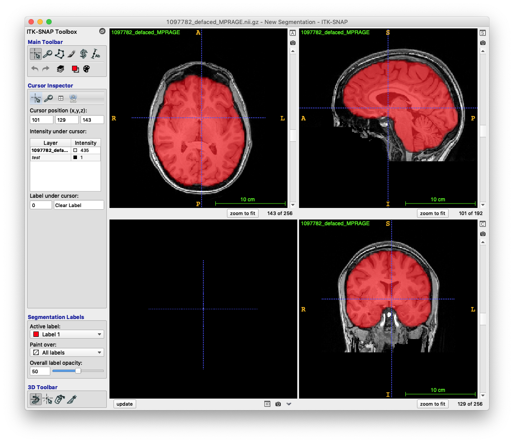

# App:  Brain Extraction

Deep learning app made for T1-weighted MRI brain extraction using ANTsRNet

## Model training notes

* Training data: IXI, NKI, Kirby, and Oasis
* Unet model (see ``Scripts/Training/``).
* Template-based data augmentation
* Lower resolution training (template size = [80, 96, 96])

## Sample prediction usage

```
#
#  Usage:
#    Rscript doBrainExtraction.R inputImage outputImage reorientationTemplate
#
#  MacBook Pro 2016 (no GPU)
#

$ Rscript doBrainExtraction.R ../Data/Example/1097782_defaced_MPRAGE.nii.gz ./outputProbabilityMask.nii.gz ../Data/Template/S_template3_resampled.nii.gz

Reading reorientation template ../Data/Template/S_template3_resampled.nii.gz  (elapsed time: 0.02612996 seconds)
Using TensorFlow backend.
Loading weights file NAtrying URL 'https://ndownloader.figshare.com/files/13606802'
Content type 'application/octet-stream' length 29774224 bytes (28.4 MB)
downloaded 28.4 MB

2018-11-19 18:10:56.720517: I tensorflow/core/platform/cpu_feature_guard.cc:140] Your CPU supports instructions that this TensorFlow binary was not compiled to use: AVX2 FMA
  (elapsed time: 22.82367 seconds)
Reading  ../Data/Example/1097782_defaced_MPRAGE.nii.gz  (elapsed time: 0.2581792 seconds)
Normalizing to template  (elapsed time: 0.2091069 seconds)
Prediction and decoding (elapsed time: 25.59897 seconds)
Renormalize to native space  (elapsed time: 0.3403041 seconds)
Writing outputProbabilityMask.nii.gz   (elapsed time: 0.4400001 seconds)

Total elapsed time: 26.87205 seconds
```

## Sample results


